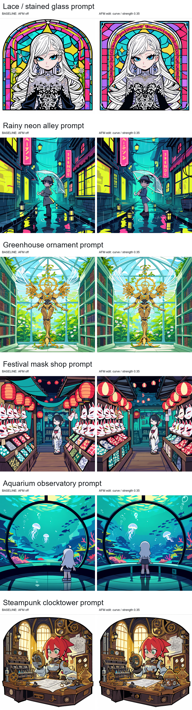
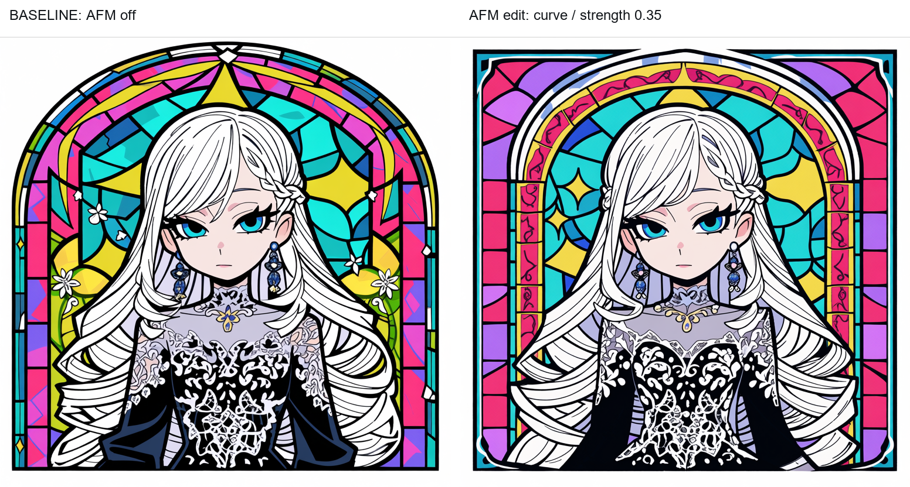
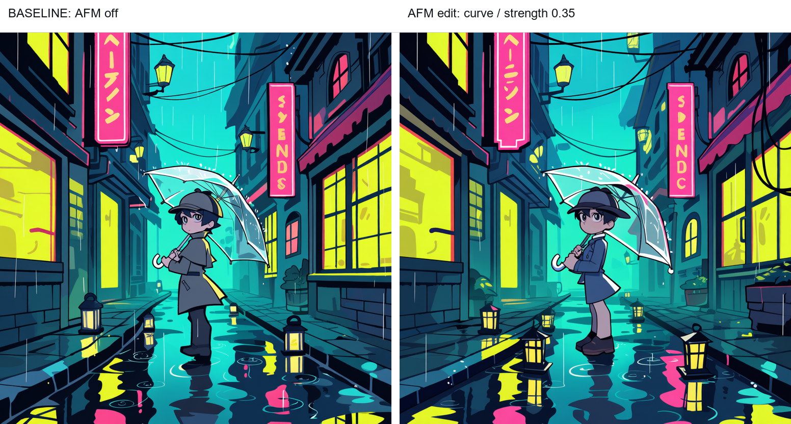
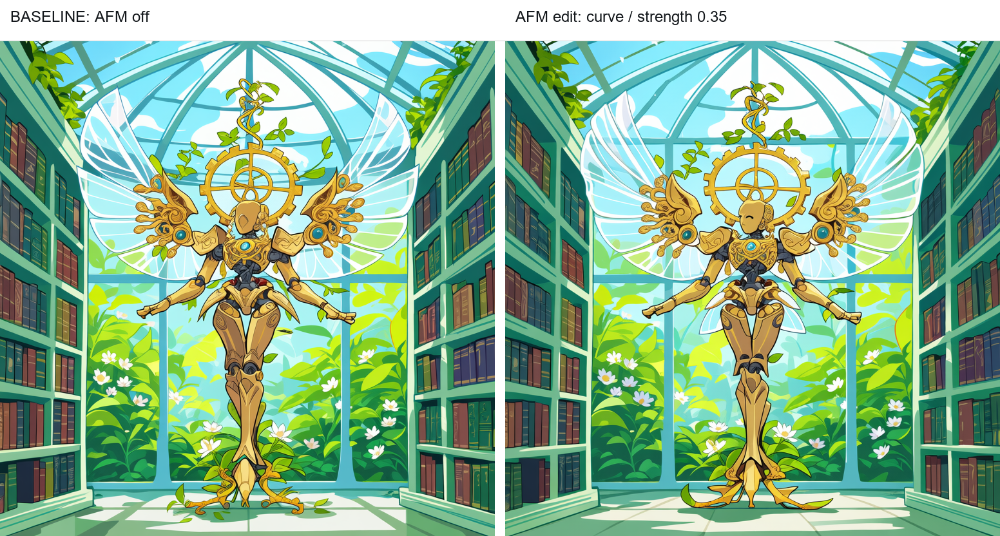
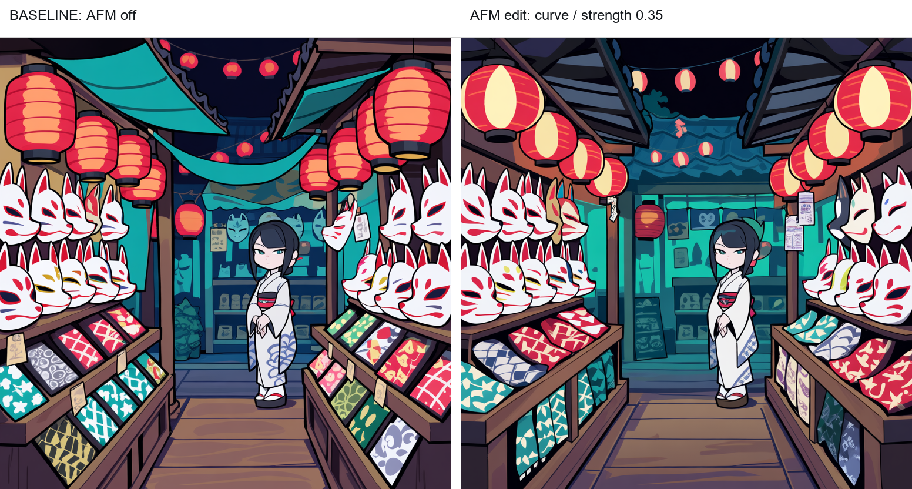
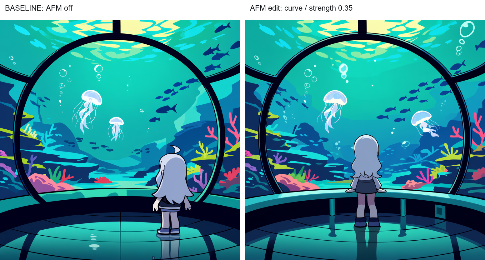
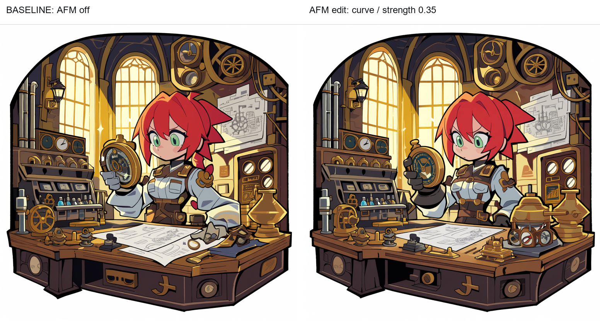
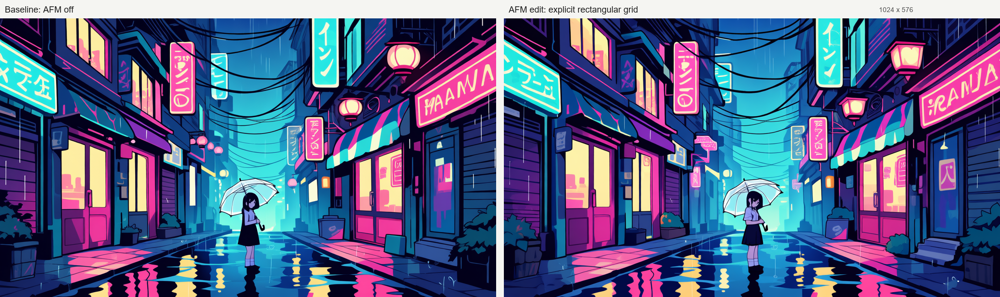
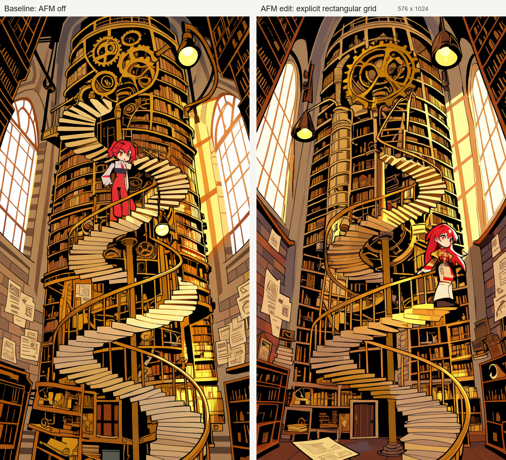
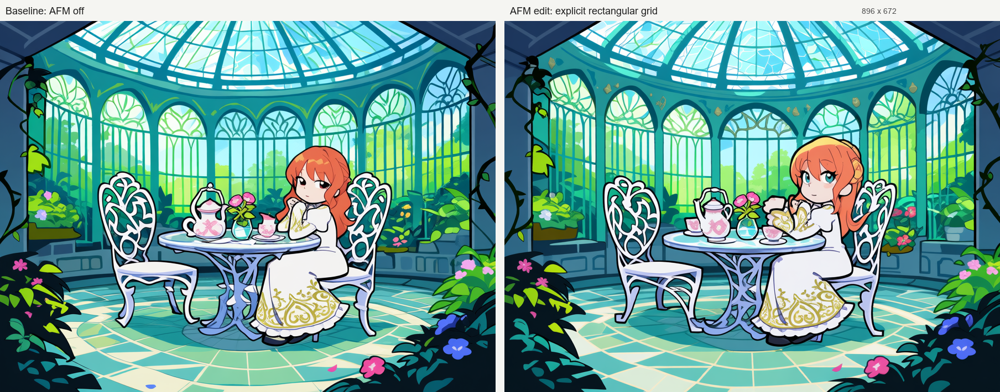

# Anima AFM Model Patch: アテンションの周波数を操作する実験ノード

`Anima AFM Model Patch` は、論文で提案された Attention Frequency Modulation、略して AFM を、Anima/Cosmos 系の DiT モデル向けに試せるようにした ComfyUI カスタムノードです。画像をあとからシャープ化する後処理ではなく、生成の途中で「どの画像位置が、どのテキストトークンをどれくらい見るか」というアテンションの地図そのものを周波数方向に変調します。

重要なのは、このリポジトリが元論文そのものの実装ではなく、AFMの考え方をAnima向けに移植・実験している点です。元論文は主に Stable Diffusion の U-Net 内クロスアテンションを対象にしていますが、このノードは Anima/Cosmos 系の DiT で観測できるクロスアテンション呼び出しを対象にします。



## 元になった技術

元になっている論文は、Seunghun Oh と Unsang Park による `Attention Frequency Modulation: Training-Free Spectral Modulation of Diffusion Cross-Attention` です。手元のPDFは [2603.28114v1.pdf](../2603.28114v1.pdf) で、arXiv ID は `2603.28114v1`、日付は 2026年3月30日です。

この論文の主張を初心者向けに言い換えると、次のようになります。

1. 画像生成中のクロスアテンションは、時間とともに「粗い構造」から「細かい構造」へ変化する傾向がある。
2. その変化は、アテンションを画像平面上の信号と見なしてFourier解析すると観察しやすい。
3. そこで、softmax前のクロスアテンションlogitsを周波数空間で少し操作すると、再学習なしで生成結果の出方を変えられる。

論文では、AFMは「画像に高周波ディテールを直接注入する」方法ではない、と説明されています。より正確には、テキストトークン同士の競合、つまり「この場所にはどの単語が効くべきか」という割り当てを、logitsの段階で周波数的に揺らします。その結果として、見た目の構図・模様・細部・質感が変化します。

このリポジトリの価値は、その考え方をAnimaモデルで使えるようにしたところにあります。Stable Diffusion U-Netの `encoder cross-attention` にそのまま差し込むのではなく、Anima/Cosmos DiTで条件を満たすクロスアテンションを検出し、画像queryグリッドを `height x width` として復元できる場合にFFT編集を行います。

## 何ができるのか

AFM は Attention Frequency Modulation の略です。直感的には、プロンプトと画像位置の結びつきを表すアテンションマップに対して、低周波成分と高周波成分の効き方を変えます。

音楽のイコライザーを想像すると分かりやすいです。低音を上げると曲全体の厚みが変わり、高音を上げるとシンバルや息づかいのような細部が目立ちます。AFMも発想としては近く、画像生成中の「注意の地図」に対して、低周波側と高周波側のバランスを変えます。

- 低周波成分: 大きな配置、輪郭、構図、色面のまとまりに効きやすい部分
- 高周波成分: 線、模様、髪の毛、装飾、反射、細かい背景要素に効きやすい部分

デフォルトの `schedule=curve` では、生成の前半で低周波側、後半で高周波側の寄与が強くなります。つまり、最初に大まかな構造を作り、終盤で細部の結びつきを強める、という狙いの設定です。

## 既存技術でたとえると

AFMを初めて見ると、「シャープ化の一種？」「FreeUに近い？」「ControlNetやLoRAとは何が違う？」と感じるかもしれません。完全に同じものはありませんが、近い考え方を並べると位置づけが分かりやすくなります。

| 技術 | 何を触るか | AFMとの近さ |
| --- | --- | --- |
| 画像編集のシャープ/ハイパス | 生成後のピクセル | 周波数という考え方は近いが、AFMは生成中に介入する |
| FreeU | U-Netのbackbone/skip feature | 周波数フィルタを使う点は近いが、触る場所が違う |
| ControlNet | 構図や姿勢などの条件入力 | 画像の誘導ではあるが、周波数操作ではない |
| LoRA | モデル重みの差分 | 学習済みの作風や概念を足す技術で、AFMは学習不要の実行時パッチ |
| CFG | positive/negative条件の押し引き | 条件の効き方に関係するが、AFMはその内部のアテンション分布を加工する |

### FreeUとの違い

FreeUは、Stable Diffusion系でよく知られている「学習なしで画質を変える」技術です。U-Net内部のbackbone featureとskip featureのバランスを調整し、skip feature側にはFourier filterを使った周波数処理が入ります。ComfyUI向けにも、たとえば [ComfyUI_FreeU_V2_advanced](https://github.com/Shiba-2-shiba/ComfyUI_FreeU_V2_advanced) のように、FreeU V2の係数や適用タイミングを細かく扱うノードがあります。

元論文でも、FreeUとSAGは「再学習なしでサンプリング中に介入する代表例」としてAFMとの比較対象にされています。読者に説明する時も、FreeUを引き合いに出すと「学習せず、生成中の内部状態を少し変えて絵を変える技術」という大枠が伝わりやすくなります。

ここはAFMと似ています。どちらも「モデルを再学習せず、生成中の内部表現を触る」技術であり、「周波数」を使って見た目を変えます。

ただし、触っている場所は別です。

- FreeU: U-Netの特徴マップを触る。絵全体の質感、立体感、ノイズ感、細部感に影響しやすい。
- AFM: クロスアテンションのlogitsを触る。テキストトークンと画像位置の結びつき、つまり「どの言葉を画面のどこに強く効かせるか」に影響しやすい。

たとえるなら、FreeUはミキサー卓で「楽器ごとの音量や帯域」を整えるような技術です。一方、AFMは譜面を見ながら「この楽器をこの場面でどこに目立たせるか」を変えるような技術です。どちらも音の周波数に関わる調整に似ていますが、操作しているレイヤーが違います。

このため、AFMを説明するときは「FreeUのアテンション版」と言い切るより、「FreeUのように学習なし・生成中・周波数を使う考え方に近い。ただしAFMは特徴マップではなくクロスアテンションを対象にする」と説明する方が正確です。

## どこを書き換えているのか

通常のクロスアテンションでは、画像側の query とテキスト側の key から logits を作ります。

```text
logits = Q x K^T x scale
```

Anima の対象パスでは、この logits はおおむね次のような形になります。

```text
[batch, heads, image_query, text_tokens]
```

`image_query` が画像グリッドとして解釈できる場合、たとえば正方形なら `4096 = 64 x 64`、16:9なら `2304 = 36 x 64` のように、各テキストトークンに対して「画像平面上のアテンション地図」を作れます。AFM はこの地図を 2D FFT にかけ、周波数空間で低周波・高周波を分けて倍率をかけ、逆 FFT で logits に戻します。そのあと通常どおり softmax と value によってアテンション出力を作ります。

処理の流れは次の通りです。

1. クロスアテンション logits を取り出す
2. 画像 query 軸を `height x width` に戻す
3. 各テキストトークンの logits マップに 2D FFT をかける
4. `cutoff` を境に低周波・高周波マスクを作る
5. `schedule` と denoise 進行度から `alpha_lf` / `alpha_hf` を決める
6. 周波数成分に倍率をかける
7. 逆 FFT で logits に戻す
8. softmax してアテンション出力を計算する

`preserve_dc=true` の場合、平均値に相当する DC 成分は保持されます。これは、全体のアテンション量を極端にずらさず、主に空間的な分布の変化として扱うための設定です。

## 主要パラメータ

| パラメータ | 意味 |
| --- | --- |
| `mode` | `edit` はAFM適用、`observe` は観測のみ、`discover` は対象候補の発見、`off` は無効化 |
| `strength` | 変調の強さ。大きいほど構図や細部が変わりやすい |
| `cutoff` | 低周波と高周波を分ける境界 |
| `schedule` | `curve`, `lf_only`, `hf_only`, `constant` から選択 |
| `branch_mode` | CFG の positive/negative/both のどれに適用するか |
| `start_percent`, `end_percent` | サンプリングのどの区間でAFMを有効にするか |
| `scope_mode`, `stage_scope` | どのクロスアテンションブロックを対象にするか |
| `target_call_indices` | 対象にする eligible call を番号で絞る |
| `spectral_diag` | 周波数変化の診断ログを出す |
| `max_logits_mib`, `max_peak_mib` | logits展開によるVRAM使用量の安全弁 |
| `spatial_shape_mode` | 画像queryグリッドの復元方法。非正方形では `explicit_pixels` が分かりやすい |
| `image_width`, `image_height` | `explicit_pixels` で使う生成画像のピクセル寸法 |
| `latent_width`, `latent_height` | `explicit_latent` で使う内部queryグリッド寸法 |

普段の比較では、まず `mode=off` を基準画像、`mode=edit` をAFM画像にして、seed・プロンプト・sampler・steps・latentサイズを固定すると分かりやすくなります。

## 比較画像

今回の比較は、同じAPIワークフロー `AFM-APIワークフロー.json` を元に、ComfyUI API から生成しました。元ワークフローで指定されていた `anima-base-v1.0.safetensors` はこの環境に無かったため、利用可能だった `capanima_base1.safetensors` に差し替えています。

共通設定:

```text
size: 768 x 768
steps: 18
sampler: er_sde
scheduler: simple
cfg: 4
baseline: mode=off, strength=0.0
AFM: mode=edit, strength=0.35, cutoff=0.25, schedule=curve, branch_mode=both
scope: scope_mode=block_scope, stage_scope=early
```

### 1. レース衣装とステンドグラス



プロンプト:

```text
anime illustration, a single girl in a black and white lace dress before a stained glass window, extremely detailed hair strands, eyelashes, ornate jewelry, tiny floral embroidery, crisp line art, rich but controlled color, clean composition
```

この例では、AFM側でステンドグラスの枠組み、髪の流れ、胸元のレース模様がより別のまとまりとして再構成されています。単純なシャープ化ではなく、アテンションの空間分布が変わるため、細部だけでなく背景の形や構図も変わります。

### 2. 雨のネオン街



プロンプト:

```text
anime illustration, a young detective with a clear umbrella in a rainy neon alley, glowing shop windows, many thin cables, wet pavement reflections, tiny lanterns, crisp line art, detailed background, balanced composition, vivid cyan magenta yellow lights
```

反射、看板、ケーブル、ランタンのような細かい要素が多いプロンプトはAFM差分が見えやすいです。AFM側では、背景の窓や反射の配置が変わり、画面内の情報の整理のされ方も変化しています。

### 3. 温室と装飾



プロンプト:

```text
anime illustration, an ornate mechanical angel in a glass greenhouse library, transparent wings, tiny leaves, golden gears, filigree ornaments, layered bookshelves, delicate flowers, crisp fine lines, calm symmetrical composition, luminous natural light
```

この例では大きな構図は近いまま、翼、歯車、植物、書棚の細部が変わっています。AFMは常に劇的な変化を起こすというより、プロンプト・seed・モデル・対象ブロックによって「細部寄り」または「構図寄り」の差として現れます。

### 4. 祭りの面屋と提灯



プロンプト:

```text
anime illustration, a calm festival mask shop at night, an elegant kimono girl standing among rows of fox masks and paper lanterns, patterned fabric, hanging cords, tiny price tags, lacquered wood shelves, crisp clean line art, vivid red gold teal lighting, detailed background
```

面、提灯、吊り紐、布柄のように、同じ種類の細かい要素が大量に並ぶ例です。AFM側では、提灯のリズムや面の並び方、店内奥行きの整理が変わっています。こうしたプロンプトは、AFMが「細部をただ強くする」のではなく、注意の割り当てを変えることを見せやすいです。

### 5. 水族館の観測ドーム



プロンプト:

```text
anime illustration, a quiet underwater aquarium observatory, a girl with silver hair watching luminous jellyfish, curved glass tunnel, tiny bubbles, coral patterns, reflective floor, delicate fish silhouettes, crisp line art, layered blue green lighting, detailed background
```

水面光、泡、魚影、ガラスの曲線など、柔らかい低周波の面と細かい高周波の点が混ざった例です。AFM側では、観測窓の形、人物の立ち位置、クラゲや魚影の分布が変わり、同じプロンプトでも画面の読み方が少し変わります。

### 6. 時計塔のアトリエ



プロンプト:

```text
anime illustration, a steampunk clocktower atelier, a red-haired engineer girl holding a brass compass, hundreds of tiny gears, glass gauges, blueprint papers, thin pipes, warm sunlight through tall windows, crisp ink lines, intricate mechanical details, balanced composition
```

歯車、計器、設計図、配管のような硬い線の細部が多い例です。AFM側では、机上の小物や背景の機械部品のまとまりが変化しています。機械・建築・装飾のように線が多い題材は、AFMの差分確認に向いています。

## 非正方形アスペクト比の比較

このリポジトリでは、Anima向けに `spatial_shape_mode=explicit_pixels` を追加し、正方形だけでなく横長・縦長の画像queryグリッドも明示寸法から復元できるようにしています。これは元論文の数式が `H x W` で書かれていることを、Anima/Cosmos DiTの実行時パッチへ拡張したものです。ただし、論文自体が16:9を実験しているわけではないため、この部分はこのリポジトリ側の実験的な拡張です。

共通設定:

```text
steps: 14
sampler: er_sde
scheduler: simple
cfg: 4
baseline: mode=off, strength=0.0
AFM: mode=edit, strength=0.35, cutoff=0.25, schedule=curve
spatial_shape_mode: explicit_pixels
latent_downscale: 16
scope: scope_mode=block_scope, stage_scope=early
```

ログでは、16:9の `1024 x 576` が `36 x 64`、9:16の `576 x 1024` が `64 x 36`、4:3の `896 x 672` が `42 x 56` として復元されました。いずれも `spatial_shape_source=explicit_pixels_downscale` で、対象cross-attentionでは空間形状不一致によるフォールバックは出ていません。

### 7. 16:9 雨のネオン路地



プロンプト:

```text
anime illustration, panoramic rainy neon alley with a single girl holding a transparent umbrella, glowing shop signs, wet pavement reflections, rows of thin cables, tiny lanterns, crisp line art, detailed background, vivid cyan magenta amber lights, readable composition
```

横長構図では、看板、窓、電線、雨の反射のような細かい要素が左右方向に広く分布します。AFM側では同じseedでも、細部の置かれ方や反射のまとまりが変わり、アテンションの空間配分が変調されていることを見比べやすい例です。

### 8. 9:16 時計仕掛けの図書館



プロンプト:

```text
anime illustration, vertical towering clockwork library, a red haired engineer girl standing on spiral stairs, hundreds of brass gears, thin pipes, dangling lamps, blueprint papers, tall windows, crisp ink lines, intricate mechanical details, warm sunlight, balanced vertical composition
```

縦長構図では、階段、歯車、窓、人物の配置が上下方向に伸びます。AFM側では人物の位置や機械部品のまとまりが変化しており、単なる後処理シャープ化ではなく、生成中の割り当てが変わることを説明しやすい例です。

### 9. 4:3 温室のティールーム



プロンプト:

```text
anime illustration, glass greenhouse tea room, elegant girl in an embroidered dress, vines, tiny flowers, mosaic tiles, filigree furniture, stained glass roof, crisp line art, luminous natural light, detailed background, balanced composition
```

4:3は正方形より少し横長で、16:9ほど極端ではありません。AFM側では窓枠、植物、テーブル周りの小物の配置が変わり、穏やかな構図でも差分を確認できます。

## プロンプトの作り方

AFMの効果を見せたい場合は、低周波と高周波の両方を含むプロンプトが向いています。

おすすめの要素:

- 大きな構図: stained glass window, greenhouse, alley, cathedral, library, symmetrical composition
- 細かい線: hair strands, eyelashes, filigree, embroidery, thin cables, tiny gears
- 細かい面: rain reflections, tiny flowers, small ornaments, jewelry, patterned fabric, bubbles
- 見比べやすい色: cyan, magenta, yellow, black and white, vivid but controlled color

避けた方がよい条件:

- 何もない背景
- 細部指定が少ないプロンプト
- seedやstepsを毎回変える比較
- 強すぎる `strength` だけで判断する比較

## 実用上の注意

AFMはサンプリング中のアテンション計算に入るため、通常の後処理よりVRAM負荷が高くなります。特に logits を明示的に作る編集パスでは、画像サイズ・heads・テキスト長によってメモリ使用量が増えます。このため、ノードには `max_logits_mib` と `max_peak_mib` の安全弁があります。

また、非正方形解像度では `spatial_shape_mode=explicit_pixels` を使い、`image_width` と `image_height` を生成解像度に合わせるのが現時点で一番安全な使い方です。たとえば `1024 x 576` なら、内部query長 `2304` を `36 x 64` として扱います。

`auto` は安全側に倒してあり、runtime metadataやblock入力から信頼できる形状候補が取れない場合は従来の正方形推定へ戻ります。候補が複数あり、互いに違う `height x width` を示す場合も `spatial_shape_ambiguous` としてフォールバックします。実機確認では、現在のAnima API実行時に16:9のshape候補は出ず、`1024 x 576` が `48 x 48` の `square_legacy` として扱われました。そのため、非正方形では `auto` ではなく `explicit_pixels` を使うのが正解です。

なお、元論文の数式自体は `H x W` の潜在空間グリッドとして定義されており、理論上は `H = W` に限定していません。一方で、論文中の実験設定は `512 x 512` の正方形画像で、16:9のような非正方形解像度を明示的に検証した記述はありません。つまり、非正方形対応はAFMの考え方をAnima向けに拡張した、このリポジトリ側の実験機能として見るのが正確です。

現在のAPI検証では、`1024 x 576`、`576 x 1024`、`896 x 672` の3ケースで `spatial_shape_source=explicit_pixels_downscale` が記録され、対象cross-attentionで空間形状不一致によるフォールバックは出ていません。ただし動画や複数フレームの `time x height x width` レイアウトはまだ対象外です。

比較や検証では、次の順番がおすすめです。

1. `mode=off` またはAFMノードなしで真の基準画像を作る
2. `mode=observe`, `strength=0.0` で対象アテンションが見つかるか確認する
3. `mode=edit`, `strength=0.1` から小さく試す
4. 差が弱ければ `0.2` から `0.35` 程度まで上げる
5. 必要なら `target_call_indices` や `stage_scope` で対象範囲を絞る

## まとめ

`Anima AFM Model Patch` は、画像生成後のピクセルをいじるノードではなく、生成途中のクロスアテンション logits を周波数空間で変調するノードです。低周波は大まかな構図、高周波は線や装飾のような細部に関わりやすく、`schedule=curve` では生成の進行に合わせてそのバランスを変えます。

そのため、AFMの比較では「同じseedで、AFMだけを切り替える」ことが重要です。細かい装飾や背景情報を含むプロンプトを使うと、アテンションの変化が視覚的に分かりやすくなります。
